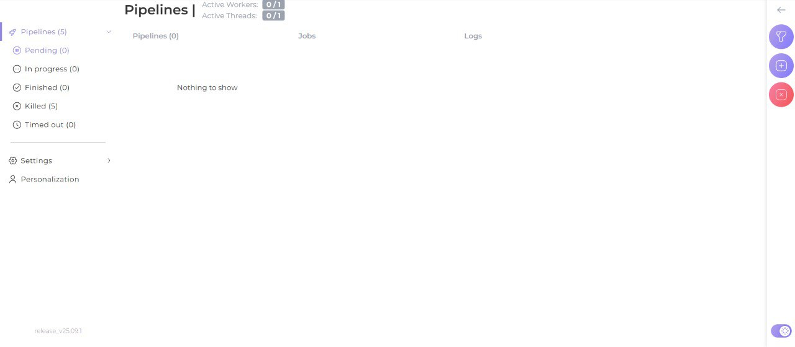
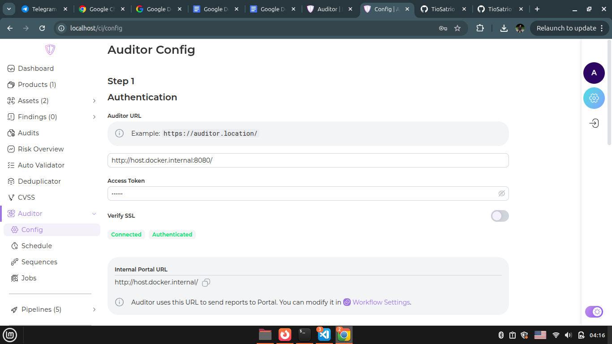
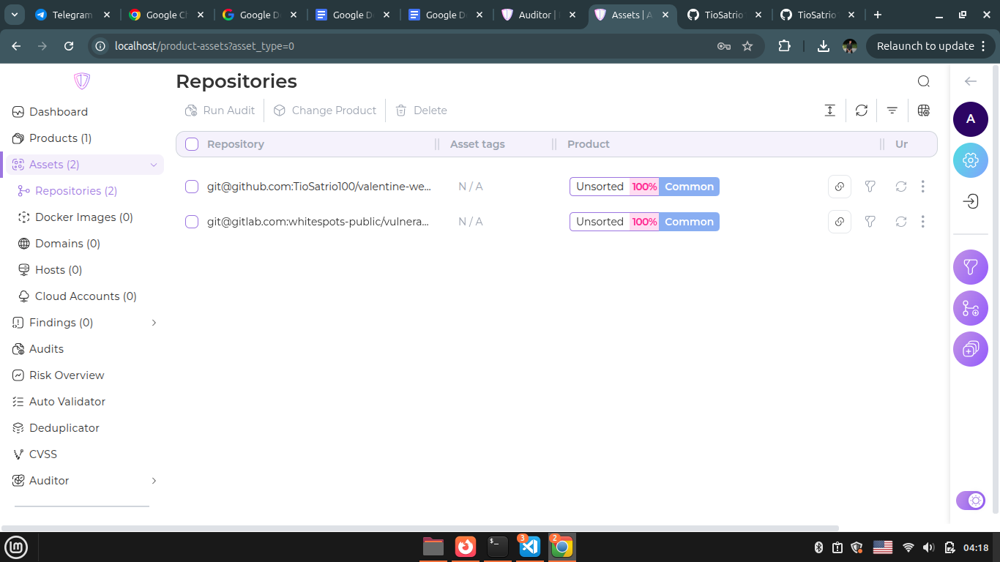
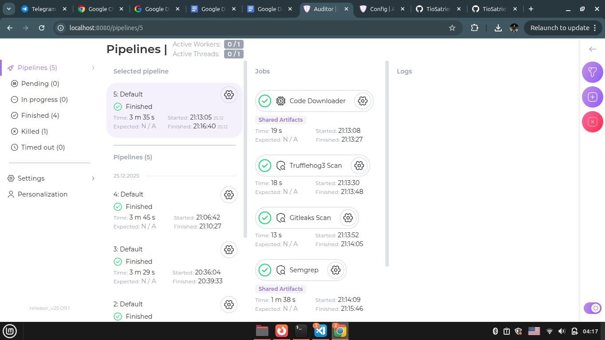
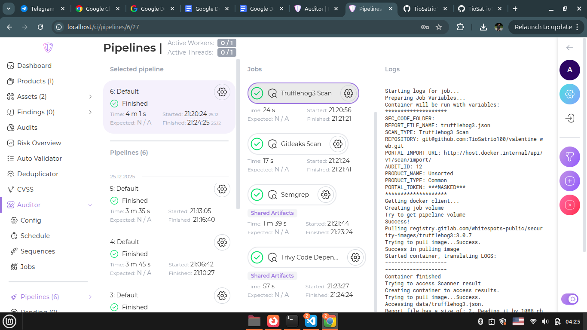
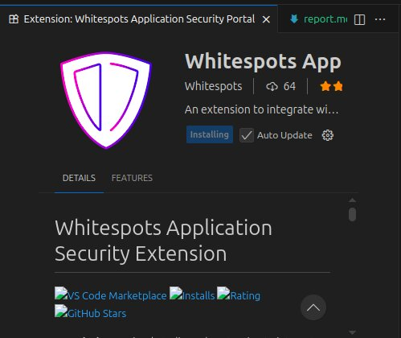

# Whitespots

## Foreword
This tool is very cool and interesting. When I first tried it, it was very difficult because it was my first time using and installing this tool. But overall, everything went well. In this report, I will write about how to run it, prepare the environment, and how to conduct an audit.

---

## Prerequisites

### Cloning the repositories
clone the following repository
git clone https://gitlab.inview.team/whitespots-public-fork/auditor.git

git clone https://gitlab.inview.team/whitespots-public-fork/appsec-portal

## let's start our work

### Run the auditor

```bash
  cd auditor
```
after that 

```bash
  docker compose up -d
```
and save the ACCESS_TOKEN we just got from localhost:8080. Then relaunch the container:

```bash
docker compose down
docker compose up -d
```




### Run the apsec portal

```bash
  cd apsec-portal
```
After that we need to prepare the environment by running several lines of commands

```bash
./set_vars.sh
echo IMAGE_VERSION=release_v25.11.3 >> .env
sh run.sh
docker compose exec back python3 manage.py createsuperuser --username admin
```
actually, we don't need to write our email specifically, we just need to fill it in.

After we log in using the license key we got, we need to configure the application.

]

Change the Auditor URL to "http://host.docker.internal:8080/", and uncheck SSL verification.
Also, change the Internal Portal URL to "http://host.docker.internal/".

Enter the key we obtained earlier from the auditor.

### Carry out Audit
add the repo you want to audit here I have added the repo from the pet project as well as the main repository ***https://gitlab.com/whitespots-public/vulnerable-apps/python-public-example***



After that run the audit for the main repo 



After that run an audit for my pet project



## Integration with IDE

I did the integration with vscode through the extension marketplace in vscode



## Conclusion

I learned how to install and configure Whitespots. I also learned how to audit our projects through Whitespots.