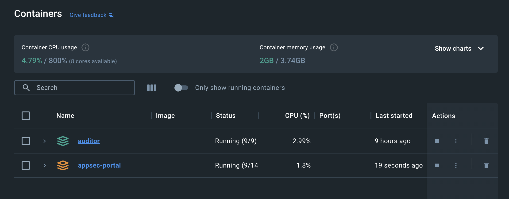
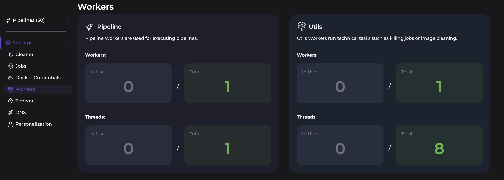
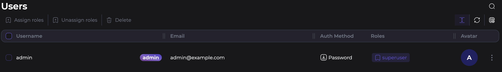
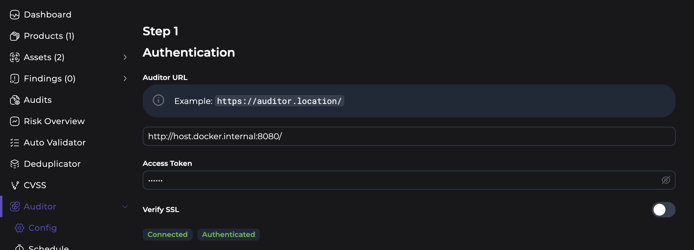
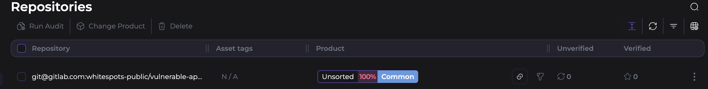
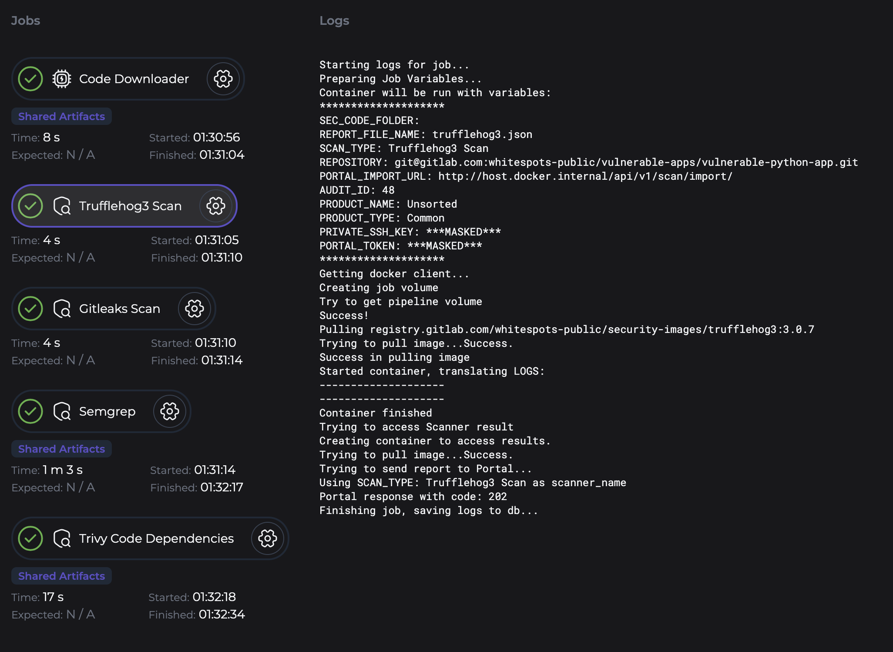
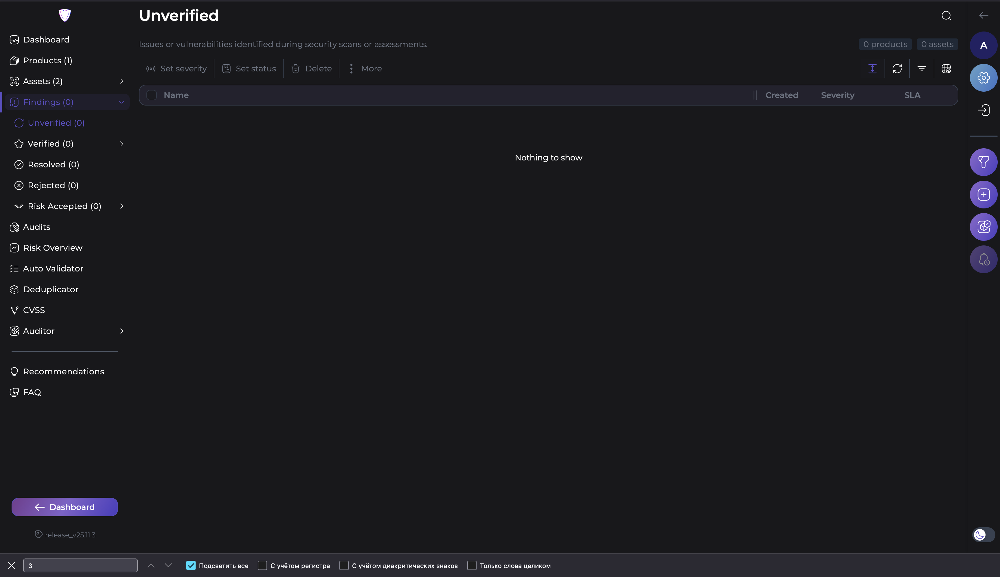

## Лабораторная работа 3star

Работу выполнили: 

Смирнова Яна

Усенко Елизавета

Атрашкевич Дарья

### Задачи

В ходе выполнения работы нам предстояло настроить связь аудитора и портала. 

Аудитор вылняет роль дирижера, он отвечает за: 

1. запуск security-сканирования

2. управление аудитами

3. создание pipeline логики

4. хранение состояния аудита 

Он знает:

1. какой репозиторий сканировать

2. какими сканерами пройтись 

3. в каком порядке использовать эти сканеры

А портал, это хранилище и UI

Портал нужен для:

1. приема результатов сканирования

2. агрегации отчетов

3. отображения уязвимостей в UI

### Что мы сделали

Сначала форкнули репозитории и склонировали их у себя локально.
Далее настроили ```.env``` с релизами образов.
Потом подняли контейнеры 



Затем перешли по хостам аудитора и портала, в которых:

Аудитор:

1. получили ACCESS_TOKEN, и добавили его в ```.env```




Портал: 

1. создали суперюзера



2. настроили аудитор, ввели url аудитора и ACCESS_TOKEN от него же, а так же вставили ssh ключ



В конце создали asset с репозиторием, который хотим проверить



И запустили аудит.

## Возникшие проблемы:

В ходе выполнения аудита, была выбрана дефолтная сборка джобов


По логам первой джобы видно, что репозиторий склонировался в ```/data``` и взята ветка main

Во второй джобе



начинаются проблемы, главная -- пустая переменна ```SEC_CODE_FOLDER:``` именно она отвечает за репозиторий. Как мы видим на логе она у нас пуста, то есть не содержит файлы, которые надо проверять. Именно по этой причине он возращает ```Portal response with code: 202```, он говорит нам "Я принял json, но он пустой))))"


# Так проиходит во всех джобах. У нас пустая переменная где должен быть склонированный репозиторий.

Нами было предприняты именения в ci и в самих джобах, но это не привело к положительному результату.

Как бы мы не хотели добавить репозиторий в переменную, он всегда оставался пустым и самим сканерам было нечего сканировать. 


## Итоги

Из-за пустой директории проверка прошла безуспешно и выявила 0 уязвимостей 




P.S. SSH ключ настроен правильно, при старте ```Core Downloader``` на гитлабе происходит изменения SSH использования, которое говорит, что ключ был использован


