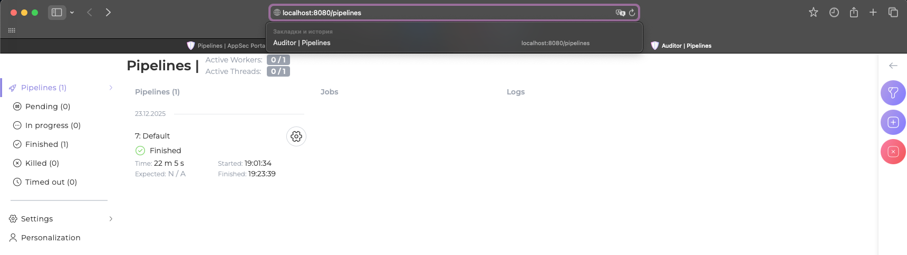
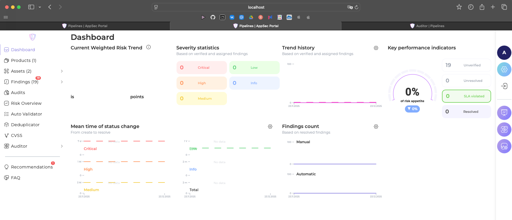
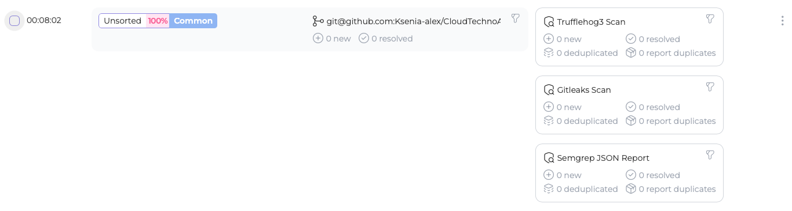
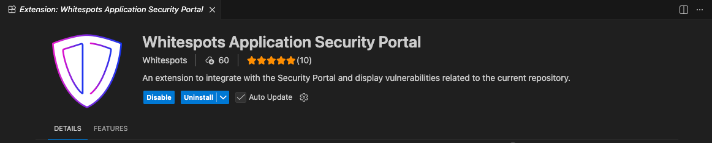
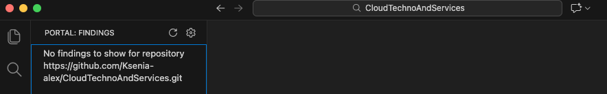

# Лабораторная работа №3 "WhiteSpots"

Выполнили:
- Толстухина Ксения Александровна 
- Туманова Нелли Алексеевна 
- Грицкевич Константин Олегович 

---

## Установка Auditor

Первым шагом мы клонировали репозиторий `https://gitlab.inview.team/whitespots-public-fork/auditor.git`  
Затем запустили контейнеры `docker compose up -d` и открыли сайт по адресу `http://localhost:8080`, там сгенерировали новый Access Token
Добавили этот токен в переменную `ACCESS_TOKEN` в `.env`  
Перезапустили контейнеры:
```commandline
docker compose down
docker compose up -d
```
В результате сайтик запустился, все работает:


## Установка AppSec Portal
Также клонировали репу `https://gitlab.inview.team/whitespots-public-fork/appsec-portal.git`  
Запустили генерацию переменных `./set_vars.sh`  
Добавили версию образа `IMAGE_VERSION=release_v25.11.3` в `.env`  
Запустили портал `sh run.sh`  
Создали админа `docker compose exec back python3 manage.py createsuperuser --username admin`  
Перешли по адресу `http://localhost:80` и добавили туда лицензионный ключ  
Все работает:  
  

## Связь Auditor с AppSec Portal
В разделе `Auditor - Config` указали адрес аудитора `http://host.docker.internal:8080/` и наш `Access Token`  
В `Workflow Settings` изменили ` Internal Portal URL` на `http://host.docker.internal/`  
Далее добавили `SHH-ключ` для клонирования репозиториев(не покажу)
В целом все подключено и готово к работе

## Добавление репозитория и сканирование
в `Assets - Repositories` добавили тестовый репозиторий `https://gitlab.com/whitespots-public/vulnerable-apps/vulnerable-java-app`  
Далее запустили аудит  
Ждали долгие `22 минуты 39 секунд` пока аудитор клонировал проект и проверял код  
Были обнаружены уязвимости:  
  
Был также проверен один из своих репозиториев(собственно с остальными лабами), на удивление уязвимостей нет:  


## Интеграция с IDE
В пайчарм скачать не получилось, поэтому был выбран VS Code
Скачали:  
  
В настройках добавили URL портала и API токен
Проверили наш репозиторий  
  
Уязвимости обнаружены не были:)
