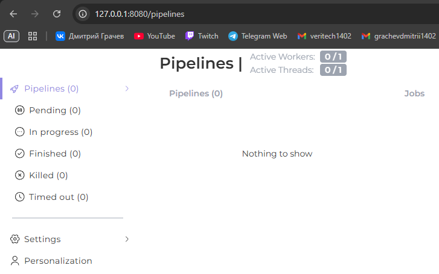
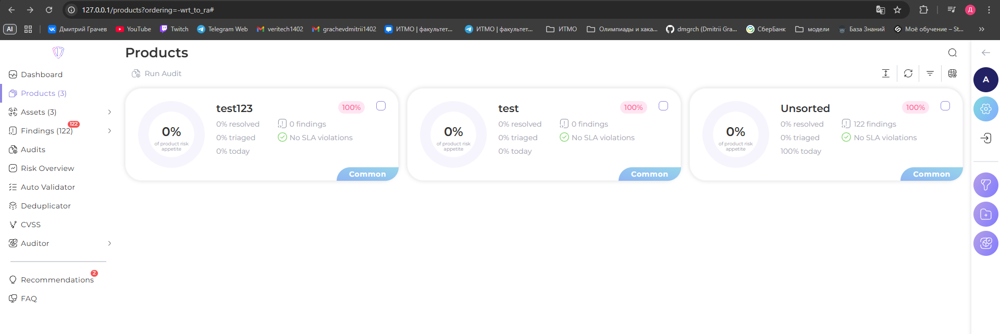
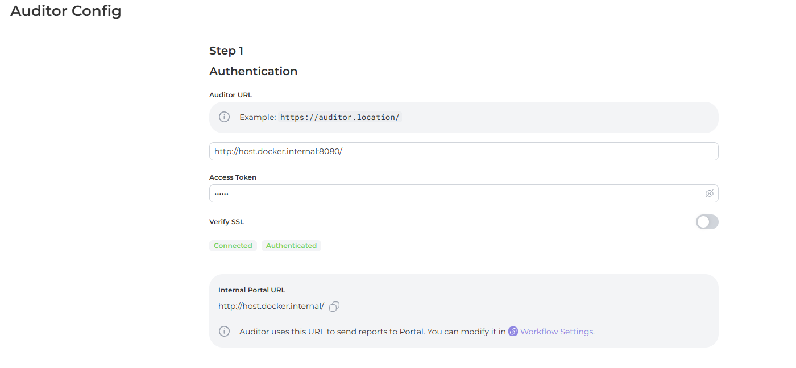
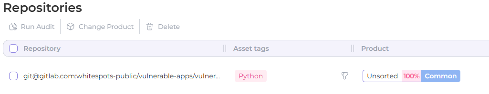
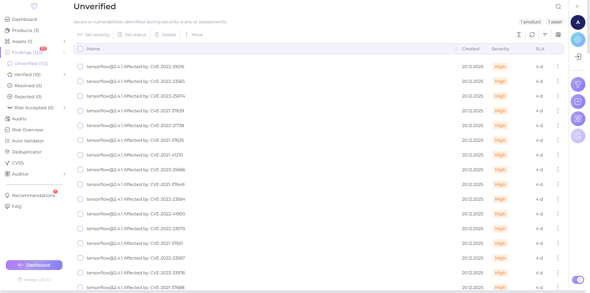
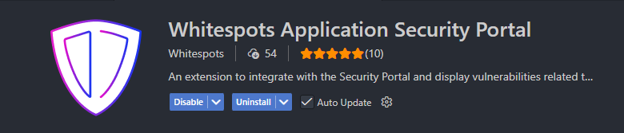

# Лабораторная работа 3

Выполнили:
- Грачев Дмитрий Александрович
- Кармазин Арсений Захарович
- Короткова Алиса Александровна
- Трофименко Егор Алексеевич

## 1) Установка AppSec Portal и Auditor
1) Склонировали репозиторий
``` git clone https://gitlab.inview.team/whitespots-public-fork/auditor.git```
2) Выполнили `docker compose up -d`
3) Перешли по адресу `127.0.0.1:8080`, сгенерировали Access Token и сохранили его
4) Добавили этот токен в переменную `ACCESS_TOKEN` в .env файл в директории `auditor`
5) Перезапустили контейнеры
```
docker compose down
docker compose up -d
```
*В итоге Auditor работает*


*После этого перешли к установки AppSec Portal*
1) Склонировали репозиторий
``` git clone https://gitlab.inview.team/whitespots-public-fork/appsec-portal.git```
2) Выполнили `./set_vars.sh` и ввели значение `release_v25.11.3` в поле `IMAGE_VERSION`
3) Запустили портал `sh run.sh`
4) Создали суперпользователя `docker compose exec back python3 manage.py createsuperuser --username admin`
5) Перешли по адресу `127.0.0.1:80` и ввели лицензионный ключ, полученный от преподавателя
*AppSec Portal работает*


## 2) Начальная настройка
Настроили конфиг аудитора в портале и добавили приватный SSH ключ
*Связали портал с аудитором*


## 3) Проверка репозиториев
1) Перешли во вкладку Assets - Repositories в портале
2) Добавили туда новый репозиторий из списка репозиториев для тестрирования - выбрали `Vulnerable python app`

3) Затем мы выбрали этот репозиторий и запустили аудит
4) После аудита во вкладке Findings появились найденные уязвимости. Некоторые из них мы подтвердили


## 4) Интеграция с IDE
Мы делали интеграцию в VSCode
1) Установили необходимое расширение в IDE, в настройках указали URL портала и API токен, полученный в настройках портала

2) Склонировали ранее добавленный репозиторий на локальную машину и открыли его в IDE
3) Вот так теперь в самом коде у нас подсвечиваются уязвимости
