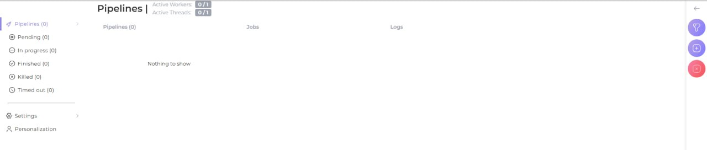
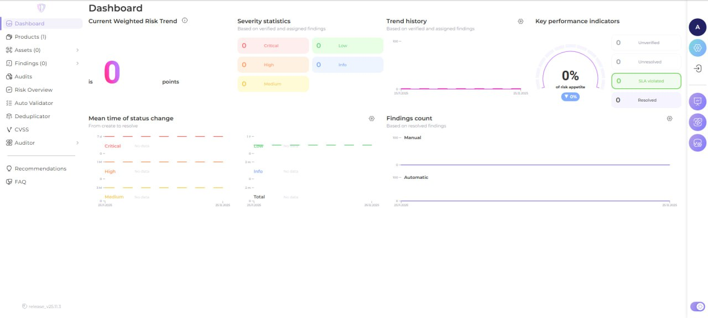
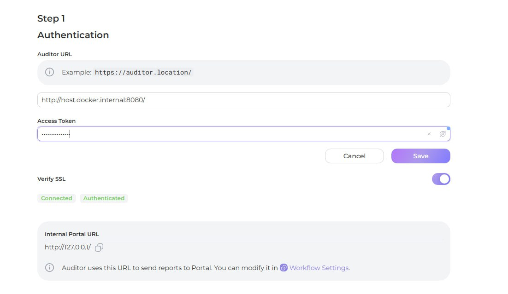
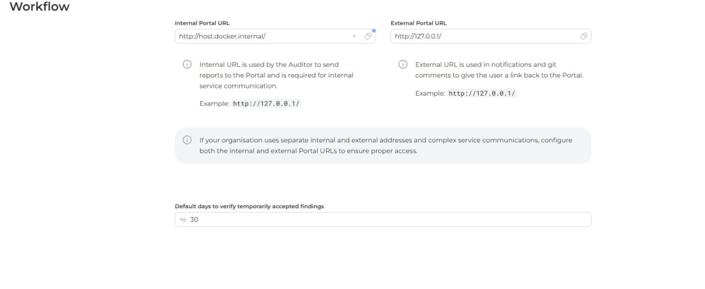
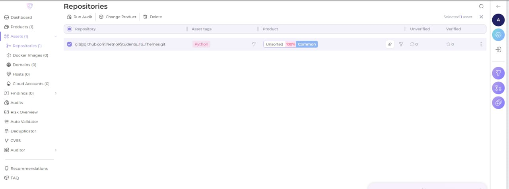
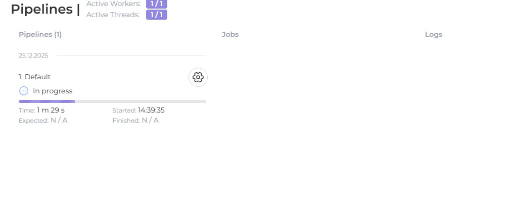
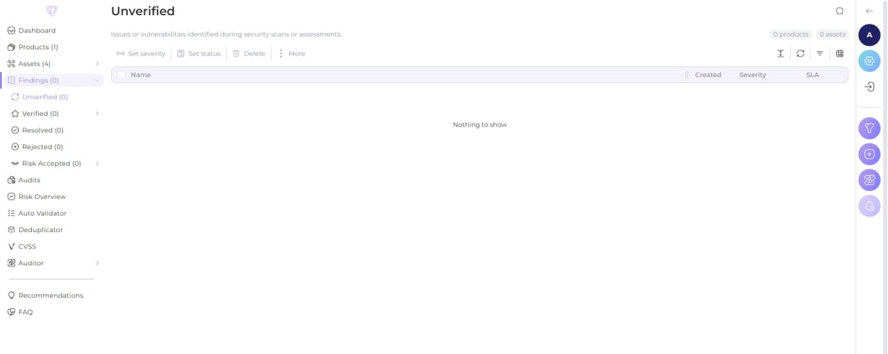
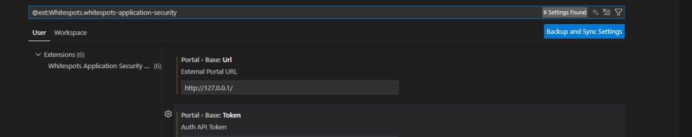
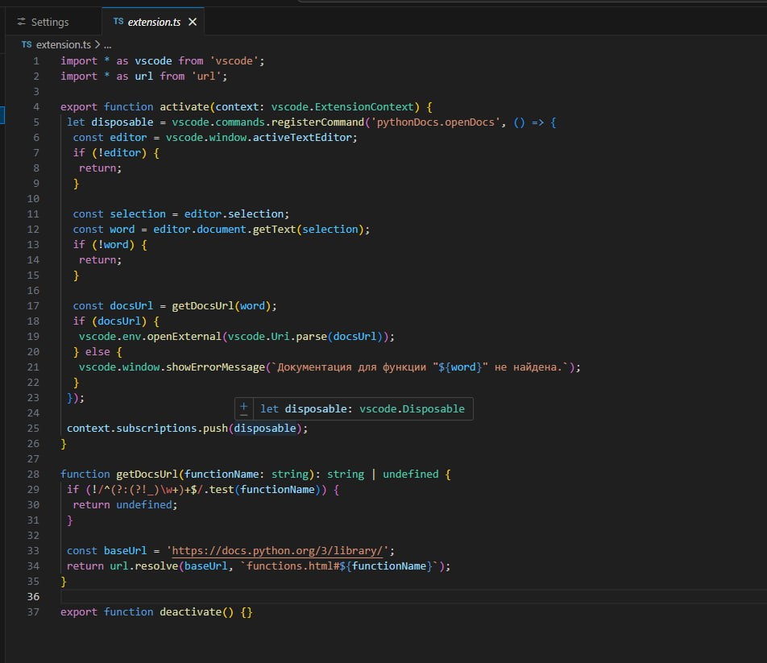

# Лабораторная работа №3*

## Установка Auditor

1. Клонируем репозиторий
```
git clone https://gitlab.inview.team/whitespots-public-fork/auditor.git    
```
2. Поднимаем докер
```
docker compose up -d
```
3. Открываем Auditor по ```127.0.0.1:8080```.
4. В окне видим Auditor, который предлагает нам сгенерировать ключ, либо зайти в аккаунт

И ни в коем случае не входите в аккаунт, на автора это плохо повлияло - настолько, что он сменил уже два компьютера, пока писал лабораторную.

Потому что иначе, если вы войдете, то в жизни не увидите AССESS TOKEN, а он генерируется только один раз и на всю жизнь.

Также автор в попытках получить токен на родном ноутбуке пытался получить его всяческими способами, но к сожалению, действие необратимо.

Так что, сгенерировав токен, запишите его себе куда-то, так как поднимать\удалять заново localhost бесполезно, я пыталась, и даже если вы войдете в акк, то все равно токен нигде не пишется...

5. Далее, добавляем токен в .env файл
```
ACCESS_TOKEN=<токен>
```
6. Перезапустим докер
```
docker compose down
docker compose up -d
```

Дальше снова переходим по тому же адресу и получаем готовый к работе Auditor



## Установка AppSec Portal

1. Клонируем репо
```
git clone https://gitlab.inview.team/whitespots-public-fork/appsec-portal.git
```
2. Запускаем генерацию переменных
```
./set_vars.sh
```
Надо пропустить все, кроме ```IMAGE_VERSION=```, туда вписать ```release_v25.11.3```

Ну или в самом .env сделать это, а то могут ненужные символы попасть.

3. Запускаем портал
```
sh run.sh
```
4. Создаем админа, и admin это наш логин (не почта!)
```
docker compose exec back python3 manage.py createsuperuser --username admin
```
5. Открываем по адресу ```127.0.0.1:80``` и добавляем ключ

Однако, для этой лабы создание личного кабинета на платформе, которое дает 2 ключа, а потом в последствии и все 3, не дает доступа к аудитору, так что пытаться тоже бессмысленно 

К слову, даже если вы захотите поменять лицензию через лк, то все равно не выйдет, потому что оно выдаст ошибку :)



## Связь портала с аудитором

Теперь у нас работают оба сервиса - ура!

1. В AppSec заходим в раздел Auditor -> Config и пишем:

- Адрес: ```http://host.docker.internal:8080/```

- Access токен из Аудитора, который мы получили выше (и записали!)



2. В Workflow settings меняем Internal Portal URL на ```http://host.docker.internal/```



3. Далее делаем в терминале
```
ssh-keygen -t ed25519
```

И мы получаем именно *публичный* ключ, приватный тоже можно достать выполнив
```
notepad $env:USERPROFILE\.ssh\id_ed25519
```
Ключ доступа откроется в блокноте

Так или иначе, публичный ключ надо привязать к GitHub/GitLab, а приватный отдать Appsec

## Добавляем репозитории

Добавляем репозиторий через интерфейс, предварительно взяв его SSH для подключения



Далее, можно выбрать желаемый репозиторий и протестировать



Однако, стоит отметить, что я тестировала как на своем репозитории, так и на тестовом и на обоих у меня не было ошибок (честно, я пыталась менять SSH ключи и подобные вещи, но почему там не было уязвимостей, я так и не поняла)



То есть я добавляла для тестирования ```https://gitlab.com/whitespots-public/vulnerable-apps```, а также свой ```https://github.com/Keyplexex/Python-Docs```

Однако, ни в том, ни в другом, уязвимостей не было

По сути, далее необходимо было подтвердить уязвимости и увидеть их в дашборде...

## Интеграция с VS Code

1. Скачиваем extension с названием ```Whitespots Application Security Portal```
2. Меняем в его настройках параметры URL и Access token (тот самый, который записали)



3. Смотрим уязвимости (которых у меня нет)




# Выводы
Первый вывод, который я сделала - записывайте все токены...

Далее, получили почти рабочий сервис для нахождения уязвимостей в репозиториях, однако у меня почему-то они не ищутся (не исключено, что это приколы Windows, так как два Macbook уже пострадали в этой работе от лицензий и токена - на одном из них вообще почему-то не связывались два сервиса, хотя и токен был верным, и ссылка тоже, но в какой-то момент просто упал Auditor, опять же, перезапуск докера и удаление, и заново проделывание всего не помогли)
