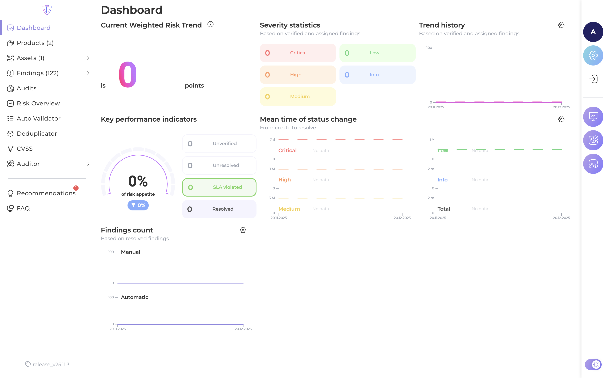
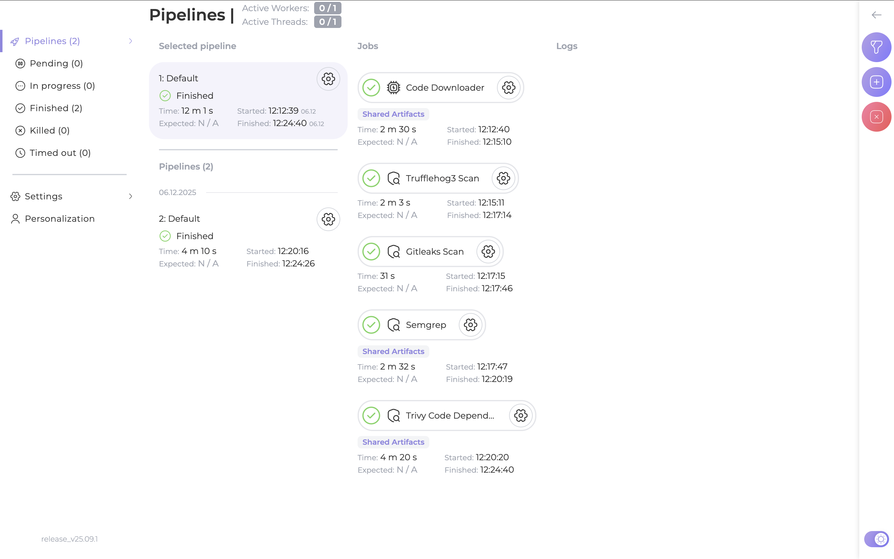
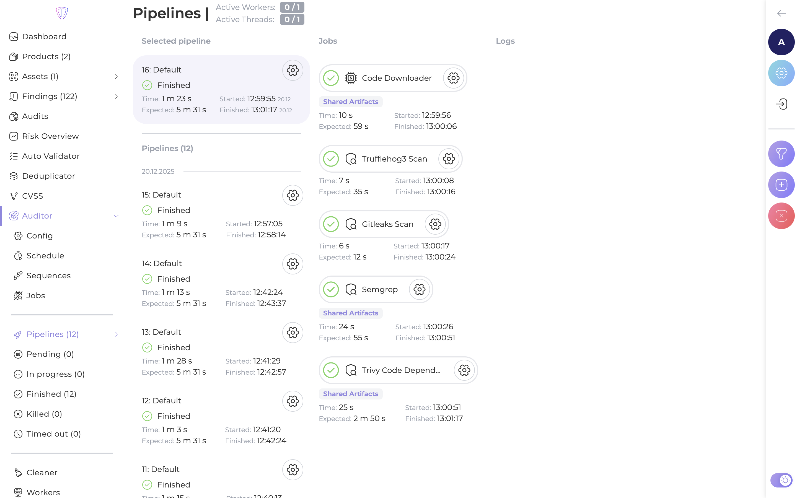
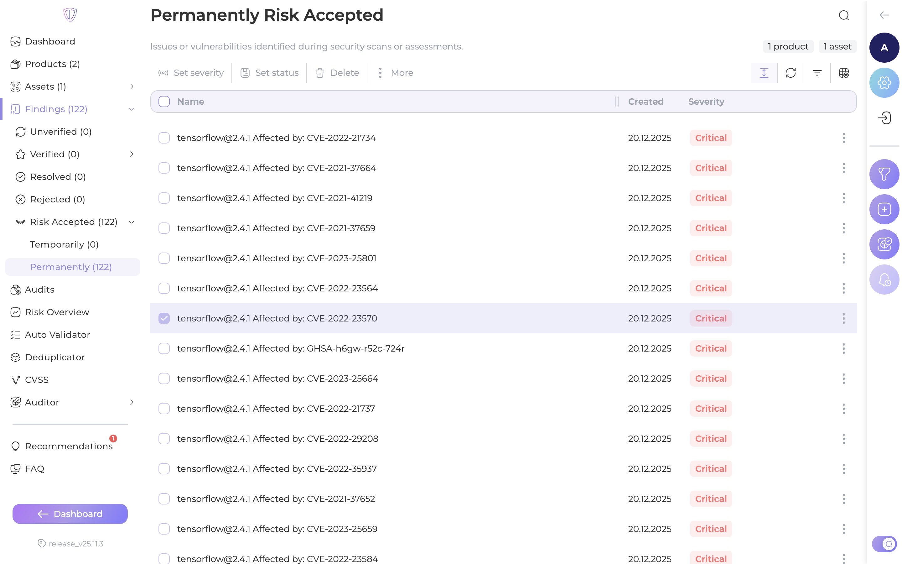
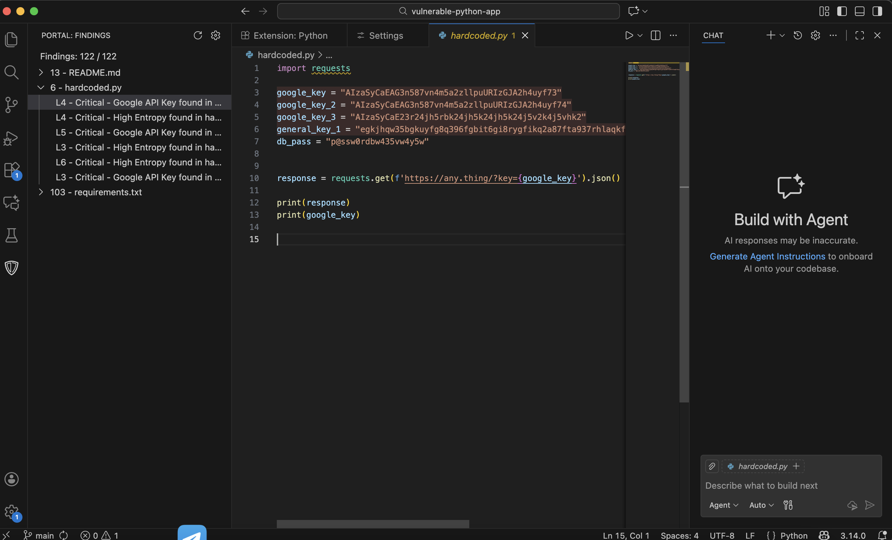

# Лабораторная №3*

**Работу выполнил**: Ковалев Руслан Бабекович


## Установка аудитора
Для начала копировал реп: ```git clone https://gitlab.inview.team/whitespots-public-fork/auditor.git```
      
Запустил в контейнере: ```docker compose up -d```
Далее запустил аудитор и сгенерировал Токен
Сохранил токен в .env и перезапустил контейнер:
```bash
docker compose down
docker compose up -d
```
**Auditor запустился, всё работает**


## Установка AppSec Portal

Клонировал реп: ```git clone https://gitlab.inview.team/whitespots-public-fork/appsec-portal.git```

Запустил генерацию переменных: ```./set_vars.sh```

Запустил: ```sh run.sh```
Создал админа:```docker compose exec back python3 manage.py createsuperuser --username admin```

Далее открыл портал и ввел ключ
**Всё завелось**



## Связь портала с Auditor

В Auditor Config указал адрес, токен


В Workflow Settings изменил Internal Portal URL и добавил SSH для клона репов.
```http://host.docker.internal/```

**Auditor подключён**


## Добавление репозиториев и запуск анализа

Добавил репов (1 из папки уязвимостей и два своих), запустил анализ, всё **заработало**





## Интеграция с IDE (VS Code)
Нашел токена для рассширения
В VSC установил само расширение
В настройках указал:

URL портала: ```http://127.0.0.1 и Токен API```

Далле локально склонировали реп и открыл в VSC

**После синхры расширение подтянуло финдинги с портала.**

Расширение подсвечивает уязвимости прямо в коде ( круто реально ) 
