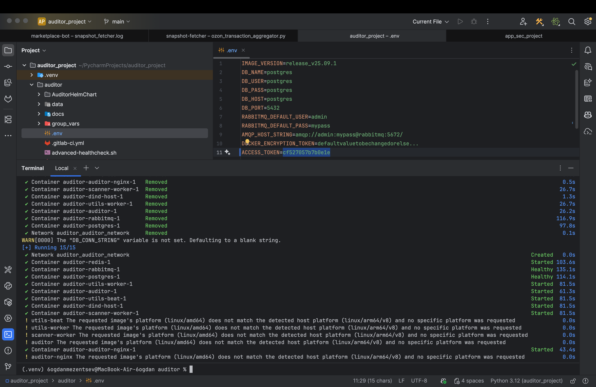
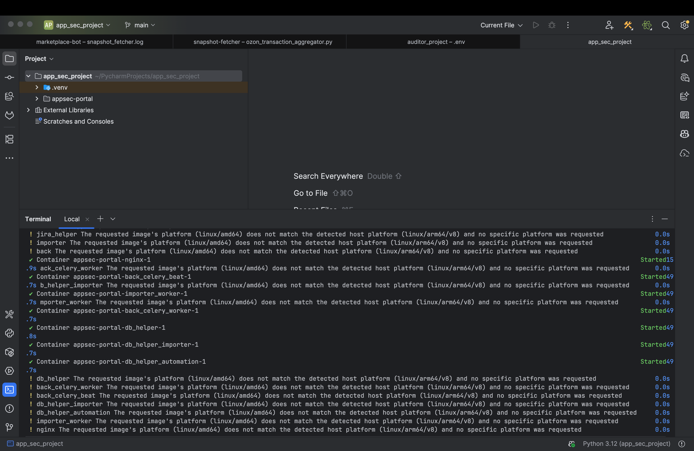
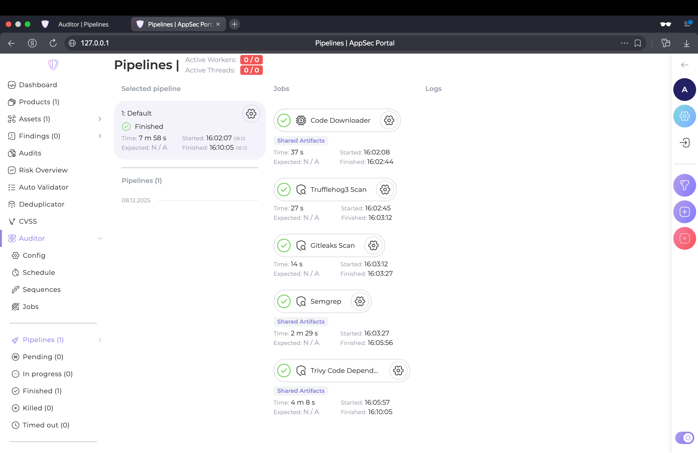
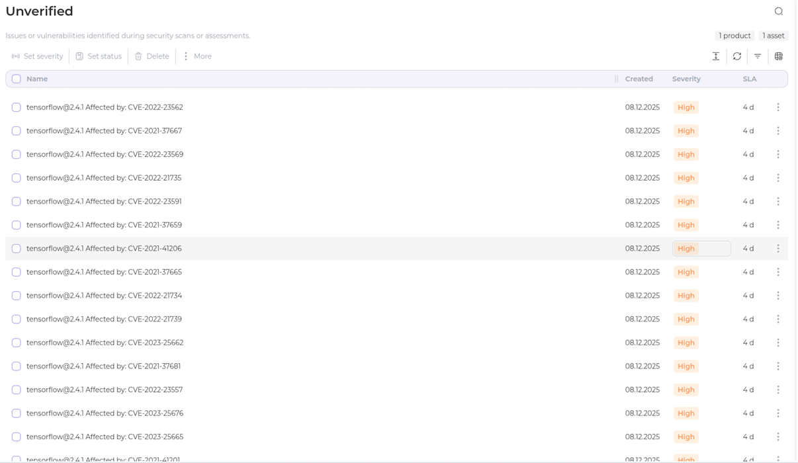
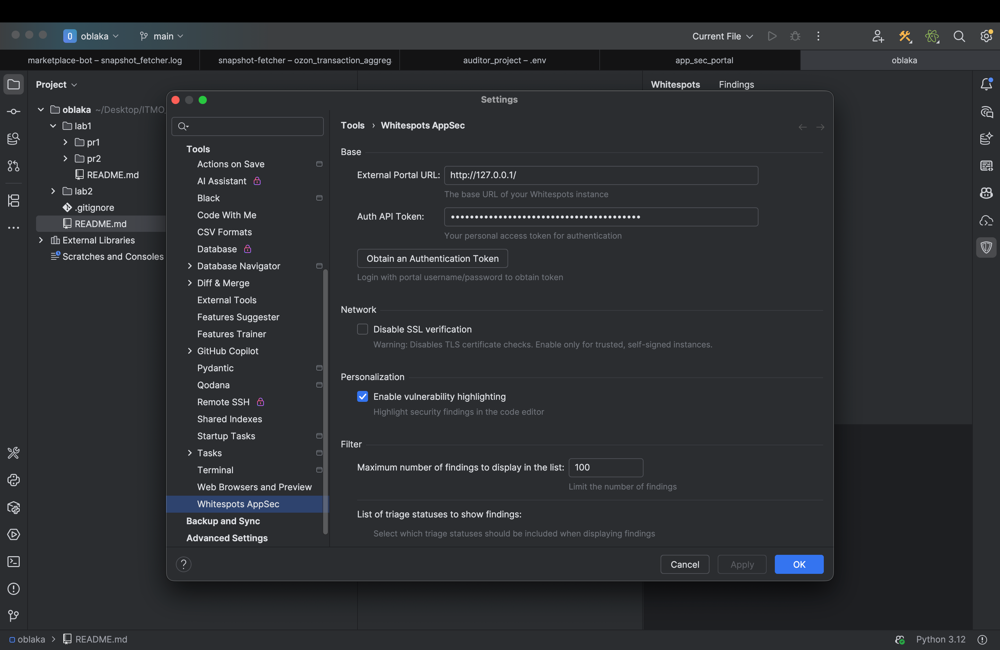
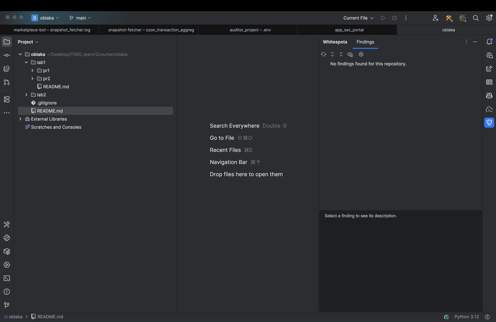

# Решение кейса 5 Whitespots (ЛР 3 со звездочкой)

Выполняли:
- Мезенцев Богдан Геннадьевич
- Колпаков Артем Сергеевич

---

## **Установка Auditor**

1. Склонировали репозиторий:

   ```
   git clone https://gitlab.inview.team/whitespots-public-fork/auditor.git
   ```

2. Поднимаем контейнеры в докере:

   ```
   docker compose up -d
   ```

3. Переходим по адресу **127.0.0.1:8080**.

4. Сгенерировали **Access Token** и сохранили его в `.env` в локальном репе, это нужно для связи с порталом.

   ```
   ACCESS_TOKEN=<токен, полученный из веб-интерфейса>
   ```

5. Перезапустили контейнеры:

   ```
   docker compose down
   docker compose up -d
   ```
   


Убеждаемся в том, что контейнеры корректно поднялись и веб-интерфейс доступен

---

## **Установка AppSec Portal**

1. Склонировали репозиторий:

   ```
   git clone https://gitlab.inview.team/whitespots-public-fork/appsec-portal.git
   ```

2. Запускаем скрипт для установки переменных окружения:

   ```
   ./set_vars.sh
   ```

3. И в `.env` добавиляем версию образа:

   ```
   IMAGE_VERSION=release_v25.11.3
   ```

4. С помощью скрипта(поднимает контейнеры в detached режиме) запускаем портал:

   ```
   sh run.sh
   ```
   
    

5. Создаем суперюзера для входа в портал:

   ```
   docker compose exec back python3 manage.py createsuperuser --username admin
   ```

6. Переходим по адресу **127.0.0.1:80** и вводим в форму лицензионный ключ.

Убеждаемся в том, что контейнеры корректно поднялись и веб-интерфейс доступен

---


Перейдите в раздел Auditor - Config. Укажите адрес аудитора http://host.docker.internal:8080/ и ваш Access Token, полученный ранее.
Измените Internal Portal URL на http://host.docker.internal/, кликнув на той же странице на Workflow Settings.
Добавьте приватный ключ (для клонирования репозиториев по SSH, должен быть привязан к вашему аккаунту на GitLab/GitHub/etc, не должен содержать пароля).
## **Настройка портала для связи с Auditor**

Портал и Auditor работают на одной машине через Docker Compose, поэтому настроили связь:

1. Переходим в раздел **Auditor → Config** и указываем:

   * Адрес:
     `http://host.docker.internal:8080/`
   * Access Token

2. В разеделе **Workflow Settings** меняем поле *Internal Portal URL*:

   ```
   http://host.docker.internal/
   ```

3. Добавляем SSH-ключ для клонирования репозиториев при запуске пайпланов:

Теперь, когда мы связали AppSec Portal и Auditor, можно пробовать запускать проверку репозитория.

---

## **Добавление репозитория и запуск пайплайна для проверки на уязвимости**

1. Переходим в рпздел **Assets → Repositories** и добаялем тестовый репозиторий с уязвимостями:
   `https://gitlab.com/whitespots-public/vulnerable-apps/vulnerable-python-app`

2. Запускаем аудит и смотрим результат:


  


  


## **Интеграция с IDE**

1. В профиле пользователя в **AppSec Portal** нашли **Auth API токен** для работы расширения.

2. Мы использовали **PyCharm**, где через раздел Plugins нашли и установили расширение Whitespots Application Security Portal Whitespots.

3. В настройках расширения указали:

   - URL портала: `http://127.0.0.1/`
   - API токен, полученный в портале


   
   

   После сохранения настроек расширение успешно подключилось к порталу.

4. Чтобы протестировать, запускаем аудит для нашего локального репозитория, который мы использовали для лаб по девопсу, и видим, что уязвимостей в проекте не найдено:


   


---

## **Итог**

Пункты 1-4 из этого кейса выполнены. Теперь есть возможность добавлять репозитории через веб-интерфейс портала и запускать для них аудиты.
Или запускать аудиты для локальных репозиториев с помощью настроенного расширения в IDE.
