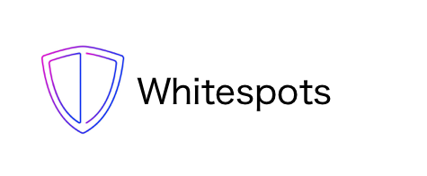
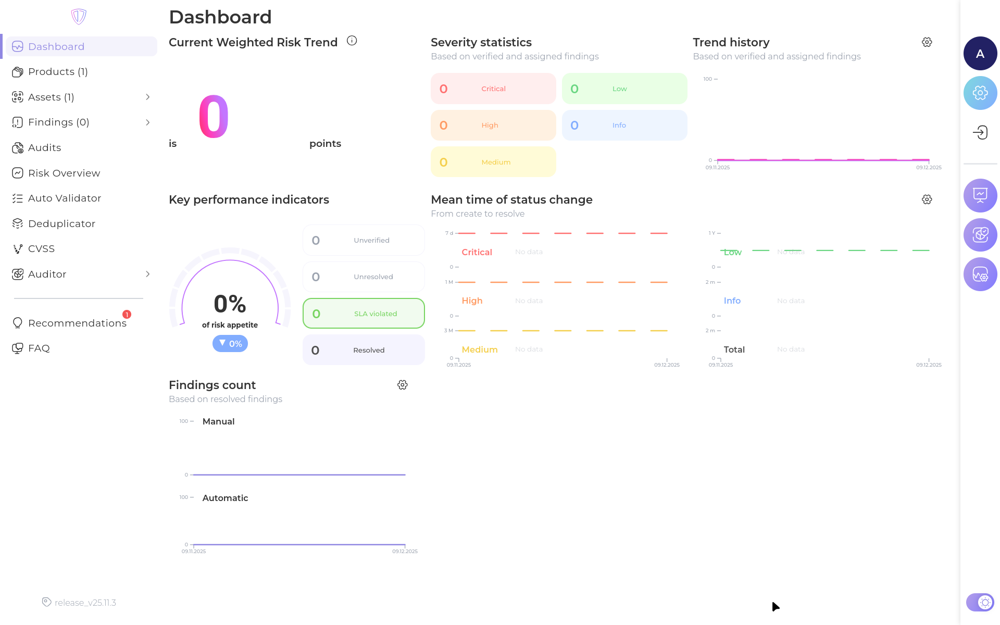
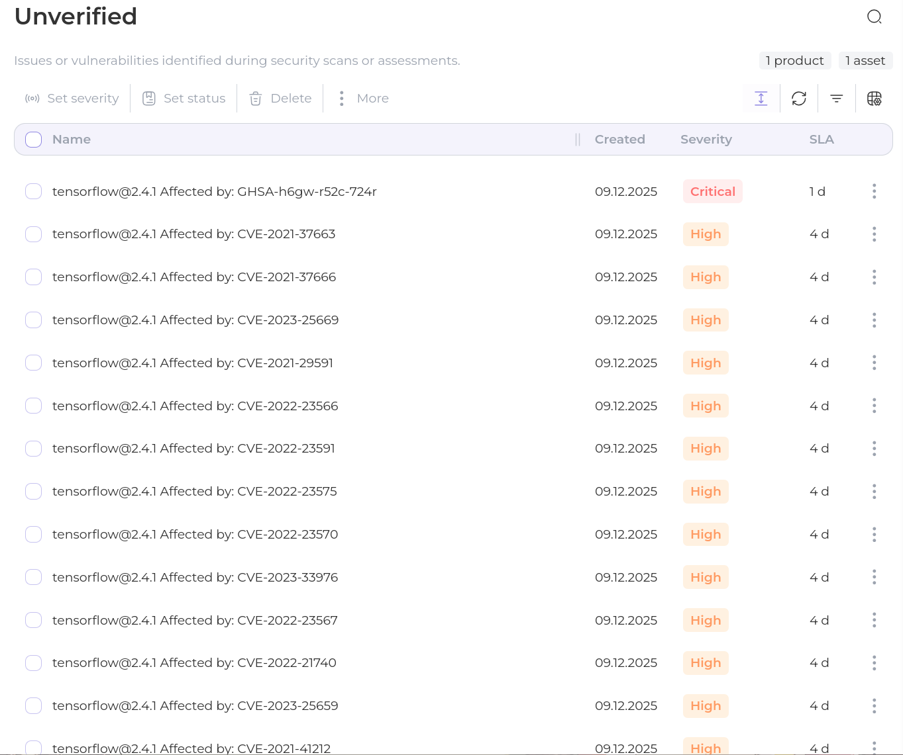
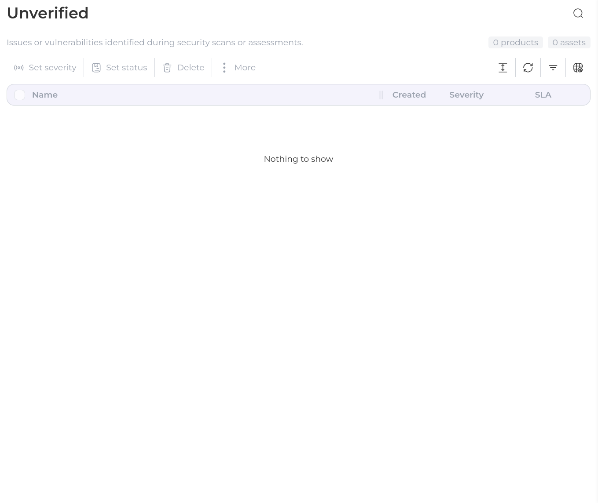
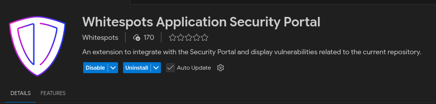
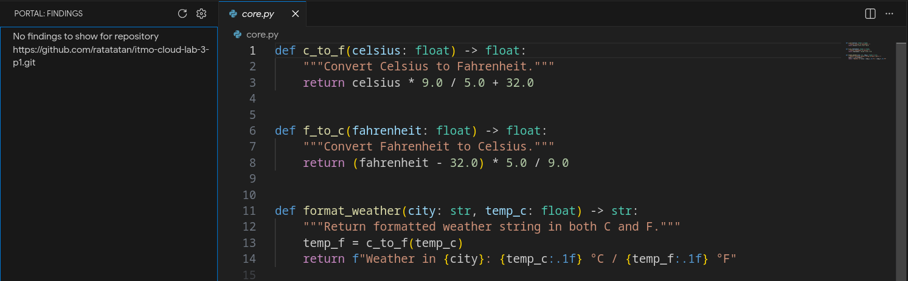
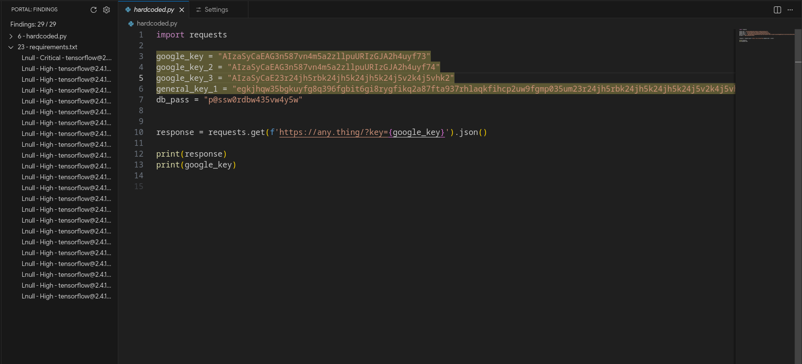

Case 5 - Whitespots
===


# Foreword
So long and thanks for the workshop!
In this pull request, we will cover checkpoints 1-4.

# Prerequisites
## Clonning the repositories
For this particular solution, we will use the repositories from the workshop on 06.12.2025.
```fish
mkdir whitespots-case
cd whitespots-case 

git clone https://gitlab.inview.team/whitespots-public-fork/auditor.git
git clone https://gitlab.inview.team/whitespots-public-fork/appsec-portal
```
## Running the Auditor
```fish
cd auditor
docker compose up -d
```
Let's save our newly generated `ACCESS_TOKEN` located at `localhost:8080`.
Then relaunch the container:
```fish
docker compose down
docker compose up -d
```
## Running the AppSec Portal
```fish
cd ../appsec-portal
./set_vars.sh
echo IMAGE_VERSION=release_v25.11.3 >> .env
sh run.sh
docker compose exec back python3 manage.py createsuperuser --username admin
```
More importantly, we won't have to enter these commands again when restarting containers.

## Configuring the Portal
Jump to `localhost:80`.
Enter our credentials and access the dashboard.



In Auditor > Config, replace Auditor URL with "http://host.docker.internal:8080/", and uncheck SSL verification.
Also, change Internal Portal URL to "http://host.docker.internal/".
Enter our private key. It can be obtained by running:
```fish
ssh-keygen -t rsa -b 4096
```

## Scanning the repos!
### Vulnerable repo
Let's add a repository using Assets > Repositories > Add Repository.


Select and run the scan for the repository.


Now, let's go to Findings and analyze our vulnerabilities.
We need to confirm real vulnerabilities and reject false positives.



### Personal repo
So let's scan our ~~previous assignment~~ pet-project.



Hoorey! Our 5 lines of code were not found to be vulnerable, isn't it amazing?

## Integration with IDE
Regretfully, as my IDE does not support connecting to the portal, for this section we will be using VSCode.

First, we need to install the "Whitespots Application Security Portal" extension from the marketplace.



Now, go to Settings > Integrations > IDE Integration and select VSCode integration.
After that, we need to add our desired repo to the assets as we've done in **Scanning the repos!** section.

Using this extension, we can easily scan our code for vulnerabilities.





# Conclusion

In this case, we learned how to integrate Whitespots with our development workflow and scan our code for vulnerabilities. We also learned how to configure the Whitespots portal and integrate it with our IDE. We also learned how to scan our repositories for vulnerabilities and how to confirm real vulnerabilities and reject false positives.
