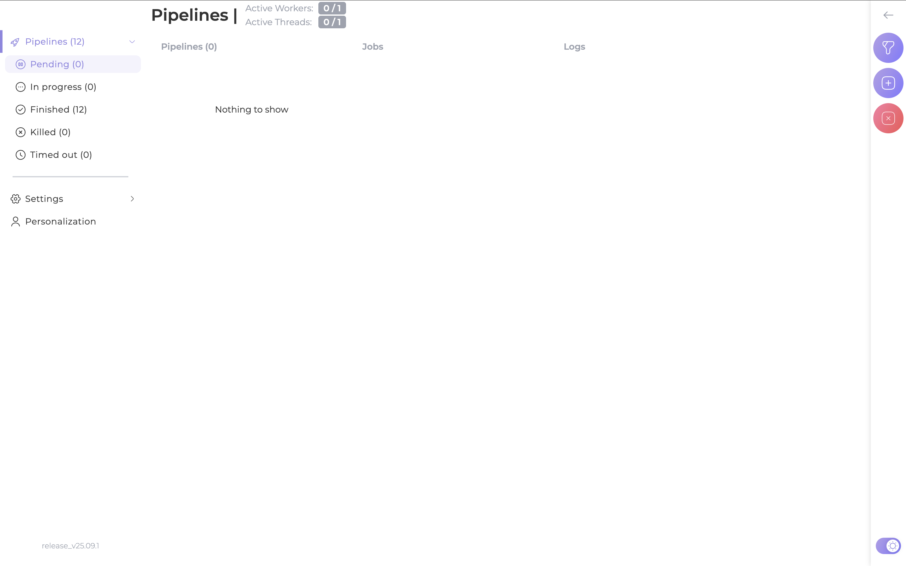
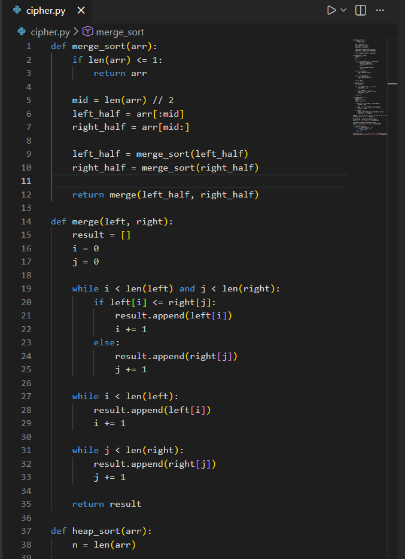

# Отчёт по установке и настройке Auditor и AppSec Portal

## 1. Установка Auditor
Клонируем репозиторий: `git clone https://gitlab.inview.team/whitespots-public-fork/auditor.git`  
Запускаем контейнер: `docker compose up -d`  
Поднимаем докер, запускаем контейнер и генерируем токен. После этого токен сохраняем в .env и перезапускаем контейнер использую команды:
'docker compose up -d'
'docker compose down'
'docker compose up -d'
Auditor готов к работе:  

## 2. Установка AppSec Portal
Также клонируем репозиторий: `git clone https://gitlab.inview.team/whitespots-public-fork/appsec-portal.git`  
Запускаем генерацию переменных: `./set_vars.sh`  
Запускаем портал: `sh run.sh`  
Создаём админа, который будет нашим логином: `docker compose exec back python3 manage.py createsuperuser --username admin`  
Открываем в браузере фдрес `http://127.0.0.1:80`, вставляем наш ключ ииии... Всё работает!

## 3. Настраиваем связь портала с Auditor
В Auditor → Config указываем адрес `http://host.docker.internal:8080/` и токен.  
А в workflow settings изменяем Internal Portal URL на `http://host.docker.internal/`.  
И добавляем SSH-ключ для добавления репозиториев: `ssh-keygen -t ed25519`.

## 4. Добавление репозиториев и запуск анализа
Берем SSH репы для подключения и добавляем сам репозиторий. 'https://gitlab.com/whitespots-public/vulnerable-apps/vulnerable-java-app'
Запускаем аудит.  

 

##Аудит pet-проекта 

## 5. Интеграция с IDE
Скачиваем расширение для VS Code под названием Whitespots Application Security Portal. Меняем в настройках параметры URL и API токен и вставляем наш репозиторий для проверки. И прямо в коде мы можем увидеть наши уязвимости(которых в нашем проекте нет).

 

## Итог
Auditor и AppSec Portal установлены, связаны, настроены для анализа репозиториев и интеграции с VS Code.Был проведен поиск и выявлен ряд уязвимостей репозитория.