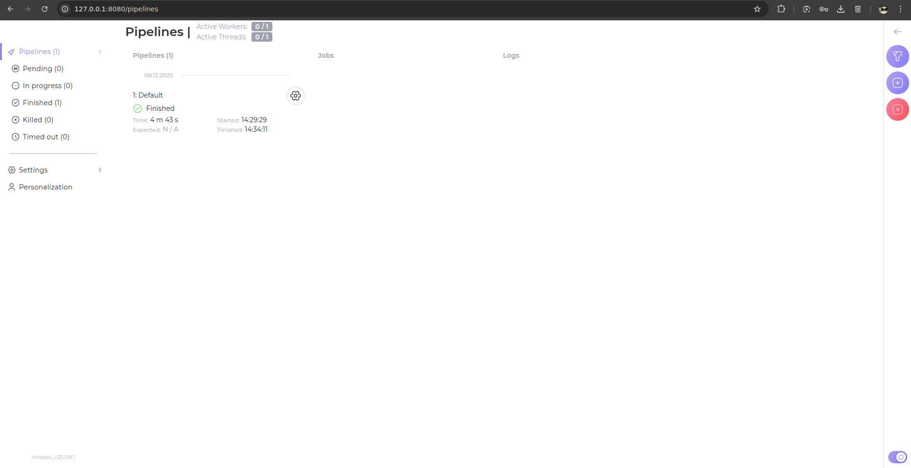
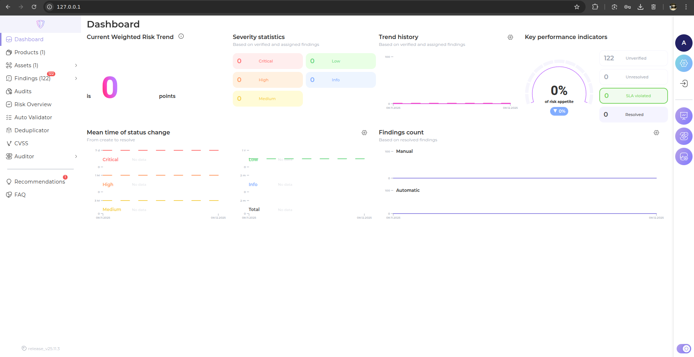
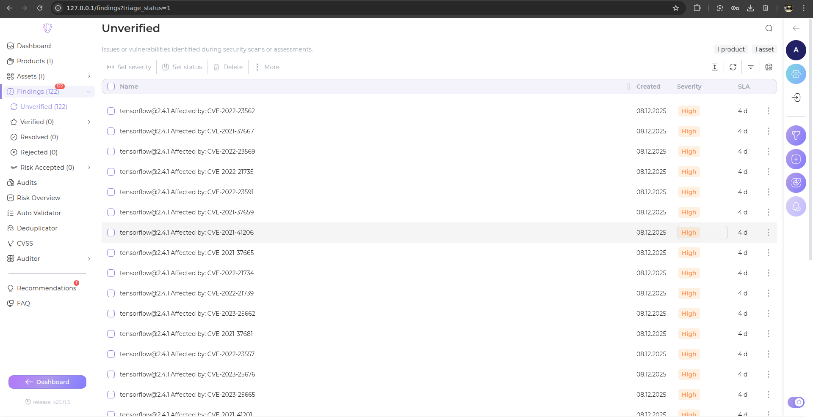
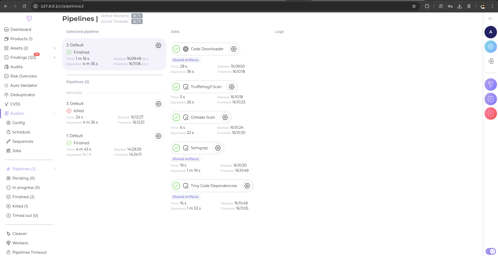
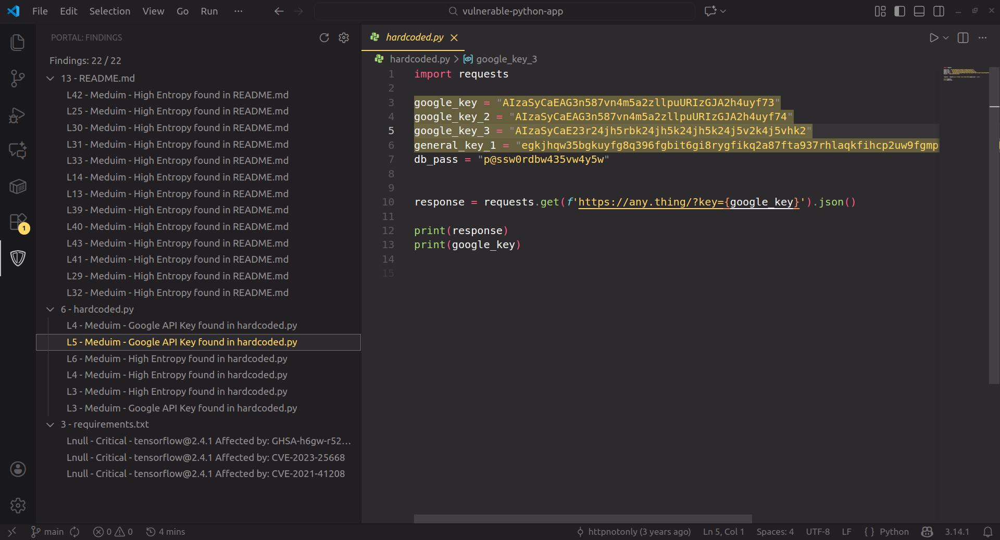

# Лабораторная работа №3

Работу выполнили:

- Сафьянчиков Арсений Сергеевич
- Жуков Ростислав Сергеевич

---

## **Установка Auditor**

1. Клонировали репозиторий:

   ```
   git clone https://gitlab.inview.team/whitespots-public-fork/auditor.git
   ```

2. Запустили в контейнере:

   ```
   docker compose up -d
   ```

3. Открыли Auditor по адресу **127.0.0.1:8080**.

4. В веб-интерфейсе сгенерировали **Access Token** для связи с порталом.

5. Сохранили токен в `.env`:

   ```
   ACCESS_TOKEN=<полученный токен>
   ```

6. Перезапустили контейнеры:

   ```
   docker compose down
   docker compose up -d
   ```

Auditor запустился, токен работает.



---

## **Установка AppSec Portal**

1. Клонировали репозиторий:

   ```
   git clone https://gitlab.inview.team/whitespots-public-fork/appsec-portal.git
   ```

2. Запустили генерацию переменных:

   ```
   ./set_vars.sh
   ```

3. В `.env` добавили версию образа:

   ```
   IMAGE_VERSION=release_v25.11.3
   ```

4. Запустили портал:

   ```
   sh run.sh
   ```

5. Создали админа:

   ```
   docker compose exec back python3 manage.py createsuperuser --username admin
   ```

6. Открыли портал по адресу **127.0.0.1:80** и добавили лицензионный ключ.

Портал запустился и работает.



---

## **Связь портала с Auditor**

Портал и Auditor работают на одной машине через Docker Compose, поэтому настроили связь:

1. В **Auditor → Config** указали:

   * Адрес:
     `http://host.docker.internal:8080/`
   * Access Token из предыдущего шага.

2. В **Workflow Settings** поменяли *Internal Portal URL*:

   ```
   http://host.docker.internal/
   ```

3. Добавили SSH-ключ для клонирования репозиториев:

    ```sh
    ssh-keygen -t ed25519
    ```

Auditor подключён к порталу, всё готово к работе.

---

## **Добавление репозиториев и запуск анализа**

1. В **Assets → Repositories** добавили тестовый репозиторий с уязвимостями:
   `https://gitlab.com/whitespots-public/vulnerable-apps/vulnerable-python-app`

2. Запустили первый аудит:

   * Auditor клонировал проект
   * проверил код
   * нашёл уязвимости в разделе **Findings**



Этим **findings'ам** можно задать статус (*Confirm/Reject*). Большинство уязвимостей связаны с библиотекой `tensorflow` в `requirements.txt` (большинство помечены отметкой *Critical/High Severity*). Также обнаружены уязвимости средней тяжести в `README.md` и в `hardcoded.py`.

После верификации определённых уязвимостей, их просмотр доступен на главном дашборде и в расширении VS Code (про это читай в следущем разделе).


3. Потом добавили свой репозиторий (библиотеку структур данных на Python с CI/CD) и тоже запустили аудит. Уязвимостей не нашлось.

    ```
    https://github.com/zhukovrost/datastructures
    ```



## **Интеграция с IDE (VS Code)**

1. В профиле пользователя в **AppSec Portal** нашли **Auth API токен** для работы расширения.

2. В **VS Code** через Marketplace установили расширение для интеграции с AppSec Portal (Whitespots Application Security Portal Whitespots).

3. В настройках расширения указали:

   - URL портала: `http://127.0.0.1/`
   - API токен, полученный в портале

   После сохранения настроек расширение успешно подключилось к порталу.

4. Локально склонировали ранее добавленный уязвимый репозиторий и открыли его в VS Code:

   ```sh
   git clone https://gitlab.com/whitespots-public/vulnerable-apps/vulnerable-python-app
   cd vulnerable-python-app
   code .
   ```

5. После синхронизации с порталом расширение подтянуло **findings** по этому репозиторию.



Уязвимости подсвечиваются прямо в исходном коде. При переходе по найденной уязвимости открывается соответствующая строка файла. Список уязвимостей в VS Code совпадает с разделом **Findings**.

