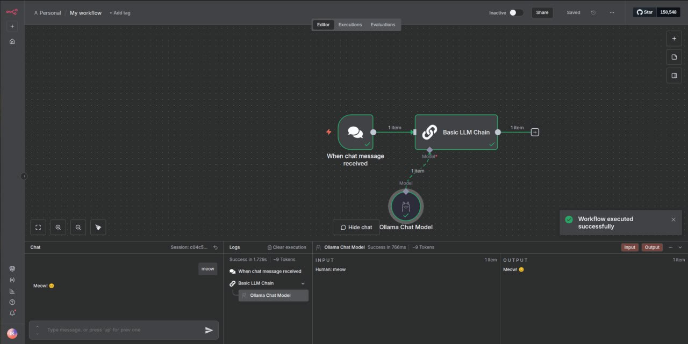

# Кейс №7 - n8n & Ollama

  

  

- [Кейс №7 - n8n \& Ollama](#кейс-7---n8n--ollama)
  - [Цель](#цель)
  - [Стэк](#стэк)
  - [Чекпоинты](#чекпоинты)
    - [Базовый](#базовый)
    - [Продвинутый](#продвинутый)
  - [Результат](#результат)
  - [Контакты](#контакты)

## Цель

Дать команде ML-инженеров возможность не зависеть от внешних веб-сервисов, а также модифицировать и устанавливать свои локальные модели и работать с ними.

## Стэк

## Чекпоинты

### Базовый
1. Установить [Postgres](https://www.postgresql.org/docs):
   - Используется для хранения воркфлоу и кредов n8n.
2. Установить [Redis](https://redis.io/docs/):
   - Используется n8n для очередей задач, ретраев и масштабирования.
3. Установить [n8n](https://docs.n8n.io):
   - Подключите к n8n установленные Postgres и Redis.
   - Для решения задачи может подойти Docker Compose.
4. Установить [Ollama](https://ollama.ai/docs):
   - Если вы начали решать задачу с помощью Docker Compose, добавьте контейнер с ollama в ваш манифест.
   - Скачайте любую подходящую LLM из [библиотеки](https://ollama.com/library).
5. Нaстроить креды в n8n:
   - Добавить Ollama в Credential n8n.
   - Использовать узел OpenAI Chat Model, указав endpoint Ollama и выбрать скачанную ранее модель.
6. Создать новый воркфлоу:
   - Вокрфлоу: Chat Message → AI Agent → Chat Model (Ollama).
   - Сессии чата сохранять во внешнем хранилище (Redis/БД), чтобы агент «помнил» контекст и между запросами.

### Продвинутый

  

  

1. Установить [Prometheus](https://prometheus.io/docs/prometheus/latest/installation/), [Alertmanager](https://github.com/prometheus/alertmanager), [Node Exporter](https://prometheus.io/docs/guides/node-exporter/)
2. Настроить несколько базовых правил алертинга:
   - Скорее всего, если вы устанавливали Victoria Metrics по одному из мануалов, у вас уже будут преднастроенные правила.
   - В поисках вдохновения можете воспользоваться источниками:
     - [Проверка алертов и маршрутов для Alertmanager](https://prometheus.io/webtools/alerting/routing-tree-editor/).
     - Огромный [список](https://samber.github.io/awesome-prometheus-alerts/rules) алертов по многим областям.
     - [То же самое](https://github.com/monitoring-mixins/website/tree/master/assets), что в предыдущем пункте, но больше примеров.
   - За алертинг в Victoria Metrics отвечает компонент vmalert, он должен быть настроен на отправку алертов в Alertmanager.
3. Настроить Alertmanager на отправку алертов в n8n Webhook.
4. Создать новый workflow:
   - Добавить Webhook‑ноду, которая принимает payload от Alertmanager.
   - Добавить шаг, который парсит payload алерта и извлекает ключевые параметры.
   - Добавить LLM‑ноду, которая формирует человекочитаемое описание инцидента и краткое резюме для сообщения в чат.
   - Добавить шаг, который создаёт задачу Incidents в GitLab с нужными полями и контекстом.

## Результат

Настроен локальный чат-бот-агент, развернутый в n8n, который обращается к LLM через Ollama и сохраняет диалог в базе/Redis.

## Контакты

Нужна помощь? Пиши в [наш Telegram чат](https://t.me/+nSELCyIX8ltlNjU6)!
